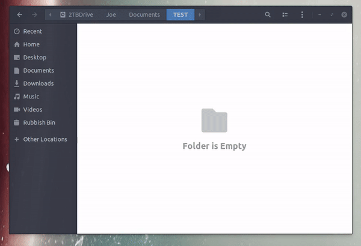

Description
===========

This Nautilis extension allows you to create template folders.
A "New Folder from Template" item will be added to the context menu when 
you right-click on the background of a folder. Selecting a folder from this
list will create a new folder in that folder and copy all of the template
items over. 

The motivation behind this was to allow entire directory structures to be
created quickly with can be very convenient if your project requires a lot 
of boilerplate such as a LaTeX project, the main document file, a bibliography,
Et Cetra. 

By including %date[] and a valid strftime format code enclosed in the brackets
the file will be copied at the code replaced. For example by creating a template
file called "This file was created on a %date[%A] at %date[%I:%M%p].txt" it will be
copied as "This file was created on a Monday at 11:33pm.txt" but with the current
day / time. A full list of the codes can be found here:
https://www.programiz.com/python-programming/datetime/strftime#format-code
Please Note that the %x and %X codes will not work as files & folders cannot have 
slashes in their names.

Demo
============

Installation
============

To install, simply run the `install.sh` script included in this repository.

This script checks that required dependencies are installed, and copies the `nautilus-new-folder-from-template.py` file to the `~/.local/share/nautilus-python/extensions` directory, as well as copying over language translation files to the same directory.

Or, if you prefer simply copy the `nautilus-new-folder-from-template.py` file to the `~/.local/share/nautilus-python/extensions` directory manualy. 

Uninstallation
============
To unstall, run the `uninstall.sh` script included in this repository.

Or delete the `nautilus-new-folder-from-template.py` file from the `~/.local/share/nautilus-python/extensions` directory.

